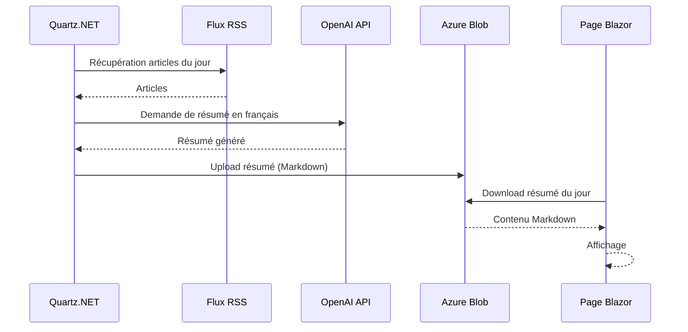

# Module EnBref

Génère des résumés quotidiens d'actualités via OpenAI et les stocke sur Azure Blob Storage.

## Flux de données



## Configuration

| Clé | Description |
|-----|-------------|
| `EnBrefConnectionString` | Azure Blob Storage connection string |
| `OpenAiApiKey` | Clé API OpenAI |

→ Voir [Configuration & Secrets](../../docs/development/configuration.md).

## Endpoints

| Méthode | Route | Description |
|---------|-------|-------------|
| `GET` | `/EnBref` | Page de lecture du résumé du jour |
| `GET` | `/api/enbref` | Résumé au format JSON |

## Tests E2E

```bash
cd tests/EndToEnd/EnBref
bru run --env production
```

## Scheduling

La génération de résumé est planifiée via Quartz.NET — configurée dans `EnBref.Infrastructure/DependencyInjection.cs`.

## Structure

```
Modules/EnBref/
├── EnBref.Application/
│   ├── Commands/GenerateSummary/
│   ├── Queries/GetSummary/
│   └── DependencyInjection.cs
└── EnBref.Infrastructure/
    ├── AzureBlobStorageReader.cs
    ├── AzureBlobStorageWriter.cs
    ├── RssFeedReader.cs
    └── DependencyInjection.cs
```
