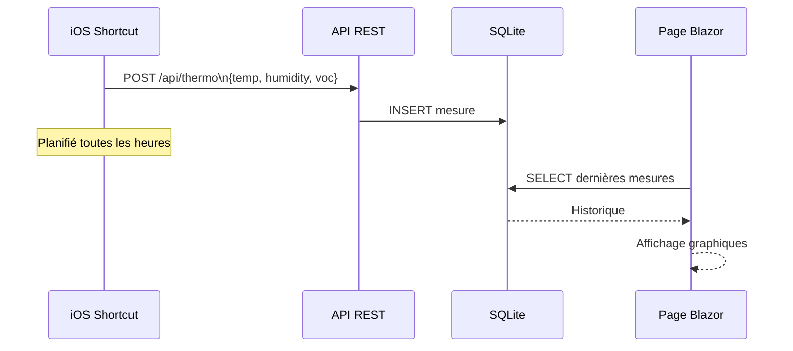

# Module Thermo

Affichage des données environnementales (température, humidité, qualité de l'air) collectées par un capteur Eve Room via un iOS Shortcut.

## Flux de données



## Endpoints

| Méthode | Route | Description |
|---------|-------|-------------|
| `GET` | `/Thermo` | Page de visualisation |
| `POST` | `/api/thermo` | Réception d'une mesure depuis iOS Shortcut |

## Configuration iOS Shortcut

[Shortcut iCloud](https://www.icloud.com/shortcuts/eb03143bd7fb4254a88d22027cb84f2f) — à planifier toutes les heures via l'automatisation iOS.

## Structure

```
Modules/Thermo/
├── Thermo.Application/
│   ├── Commands/RecordMeasurement/
│   ├── Queries/GetMeasurements/
│   └── DependencyInjection.cs
└── Thermo.Infrastructure/
    ├── ThermoRepository.cs
    └── DependencyInjection.cs
```
