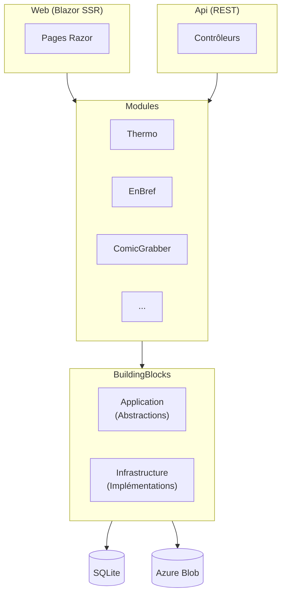

# Myfanwy

Application .NET 10 modulaire servant de hub pour diverses fonctionnalités personnelles.

[](https://github.com/yterraillon/checquy/actions/workflows/dotnet-build.yml)
[](https://hub.docker.com/r/checquy/myfanwy)

## Modules

| Module | Description | Statut |
|--------|-------------|--------|
| [**Thermo**](Modules/Thermo/Readme.md) | Température, humidité et qualité de l'air (Eve Room) | ✅ Actif |
| [**EnBref**](Modules/EnBref/Readme.Md) | Résumés quotidiens d'actualités via OpenAI | ✅ Actif |
| **ComicGrabber** | Récupération et gestion de comics | ✅ Actif |
| **MealPicker** | Sélection et planification de repas | ✅ Actif |
| **MuscleRoutine** | Routines d'entraînement | ✅ Actif |
| **CineRoulette** | Sélection aléatoire de films | ✅ Actif |
| **Nanny** | Gestion de babysitting | ✅ Actif |
| **Turneu** | Gestion de tournois | ✅ Actif |

## Quick Start

**Prérequis** : .NET 10 SDK

```bash
git clone https://github.com/yterraillon/checquy.git
cd checquy/myfanwy

# Configurer les secrets
cd Web
dotnet user-secrets set "EnBrefConnectionString" "<connection-string>"
dotnet user-secrets set "OpenAiApiKey" "<api-key>"
dotnet user-secrets set "NtfyToken" "<token>"
cd ..

# Build et run
dotnet restore myfanwy.slnx
dotnet run --project Web
```

Application disponible sur `https://localhost:5001`.

**Via Docker :**

```bash
docker build -t myfanwy:local Web/
docker run -p 8080:8080 myfanwy:local
```

## Architecture



```
myfanwy/
├── Web/               # Blazor SSR + Tailwind CSS
├── Api/               # Contrôleurs REST
├── BuildingBlocks/    # Abstractions & implémentations partagées
├── Modules/           # Modules fonctionnels (CQRS)
├── Database/          # SQLite
└── tests/             # Tests unitaires (xUnit) + E2E (Bruno)
```

## Tests

```bash
# Tests unitaires
dotnet test myfanwy.slnx

# Tests E2E (nécessite Bruno CLI)
cd tests/EndToEnd/EnBref
bru run --env production
```

## Documentation

- [Architecture globale](docs/architecture/overview.md)
- [Patterns applicatifs](docs/architecture/myfanwy-architecture.md)
- [Guide de démarrage](docs/development/getting-started.md)
- [Configuration & Secrets](docs/development/configuration.md)
- [Stratégie de tests](docs/development/testing.md)
