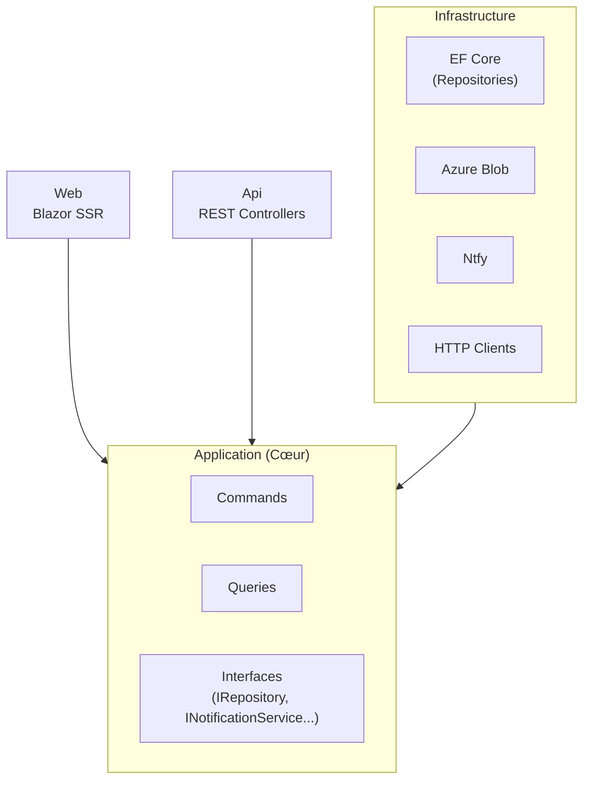
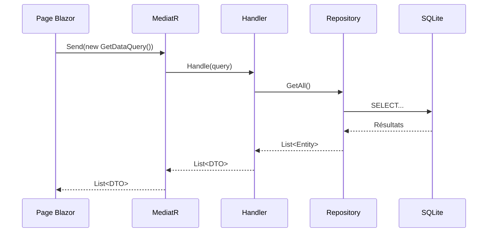
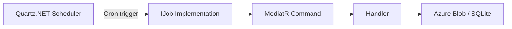

# Architecture Applicative

## Clean Architecture

Myfanwy suit les principes de Clean Architecture. Les dépendances sont dirigées vers l'intérieur : Web et Infrastructure dépendent de Application, jamais l'inverse.



## CQRS avec MediatR

Chaque module expose des **Commands** (écriture) et des **Queries** (lecture) traitées par MediatR.



## Structure d'un Module

Chaque module est découpé en deux projets :

```
Modules/{ModuleName}/
├── {ModuleName}.Application/
│   ├── Commands/
│   │   └── DoSomething/
│   │       ├── DoSomethingCommand.cs
│   │       └── DoSomethingCommandHandler.cs
│   ├── Queries/
│   │   └── GetData/
│   │       ├── GetDataQuery.cs
│   │       └── GetDataQueryHandler.cs
│   ├── DependencyInjection.cs
│   └── {ModuleName}.Application.csproj
└── {ModuleName}.Infrastructure/
    ├── {Entity}Repository.cs
    ├── {Entity}Configuration.cs    (EF Fluent API)
    ├── DependencyInjection.cs
    └── {ModuleName}.Infrastructure.csproj
```

## BuildingBlocks

Abstractions et implémentations partagées entre tous les modules.

### Application (Abstractions)

| Interface | Rôle |
|-----------|------|
| `IRepository<T>` | Accès données générique |
| `INotificationService` | Envoi de notifications (Ntfy) |
| `IObjectStorageReader` | Lecture depuis Azure Blob |
| `IObjectStorageWriter` | Écriture vers Azure Blob |
| `IAiAgent` | Interaction avec OpenAI |

### Infrastructure (Implémentations)

| Service | Implémentation |
|---------|---------------|
| Repositories | Entity Framework Core + SQLite |
| Notifications | Ntfy HTTP client |
| Object Storage | Azure.Storage.Blobs |
| HTTP Clients | HttpClientFactory |

## Enregistrement des Services

Chaque module expose une méthode d'extension `DependencyInjection.cs` :

```csharp
// Pattern standard dans {Module}.Application/DependencyInjection.cs
public static IServiceCollection AddThermo(this IServiceCollection services)
{
    services.AddScoped<IDataRepository, DataRepository>();
    // ...
    return services;
}
```

Tous les modules sont enregistrés dans `Web/Program.cs` :

```csharp
builder.Services
    .AddThermo()
    .AddEnBref()
    .AddComicGrabber()
    // ...
```

## Scheduling avec Quartz.NET

Les tâches planifiées (ex: génération de résumés EnBref) utilisent Quartz.NET, configuré dans `DependencyInjection.cs` du module Infrastructure concerné.



## Packages NuGet

Les versions sont gérées de façon centralisée dans `Directory.Packages.props` à la racine — aucune version ne doit être spécifiée dans les `.csproj` individuels.

---

→ Voir [Architecture globale](overview.md) pour la topologie de déploiement.
