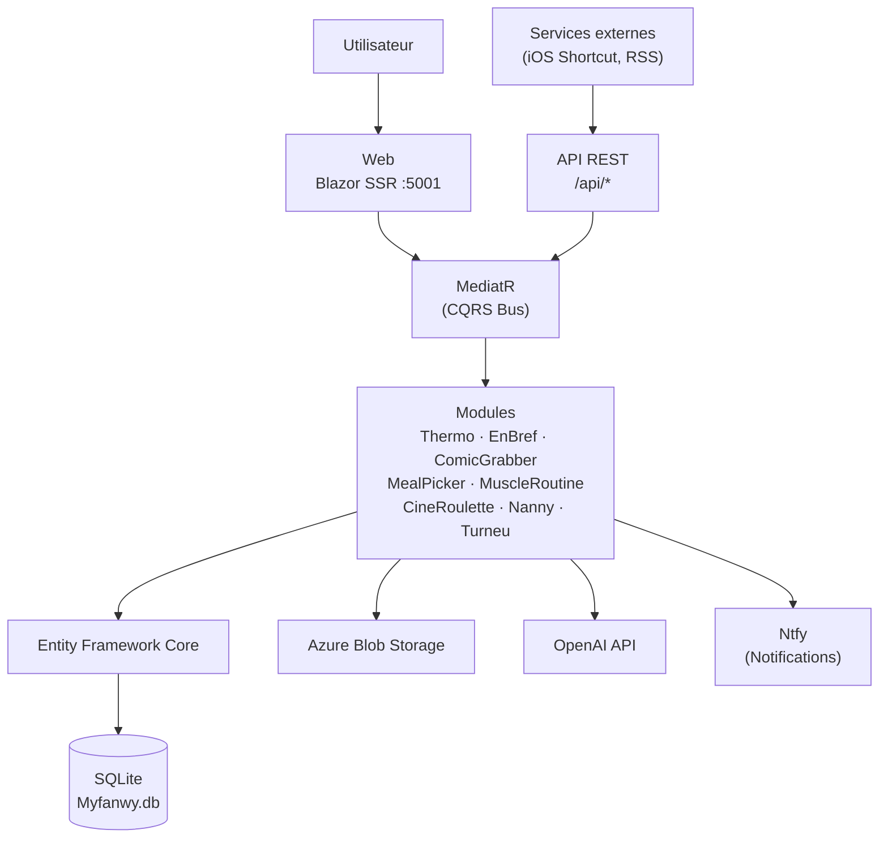
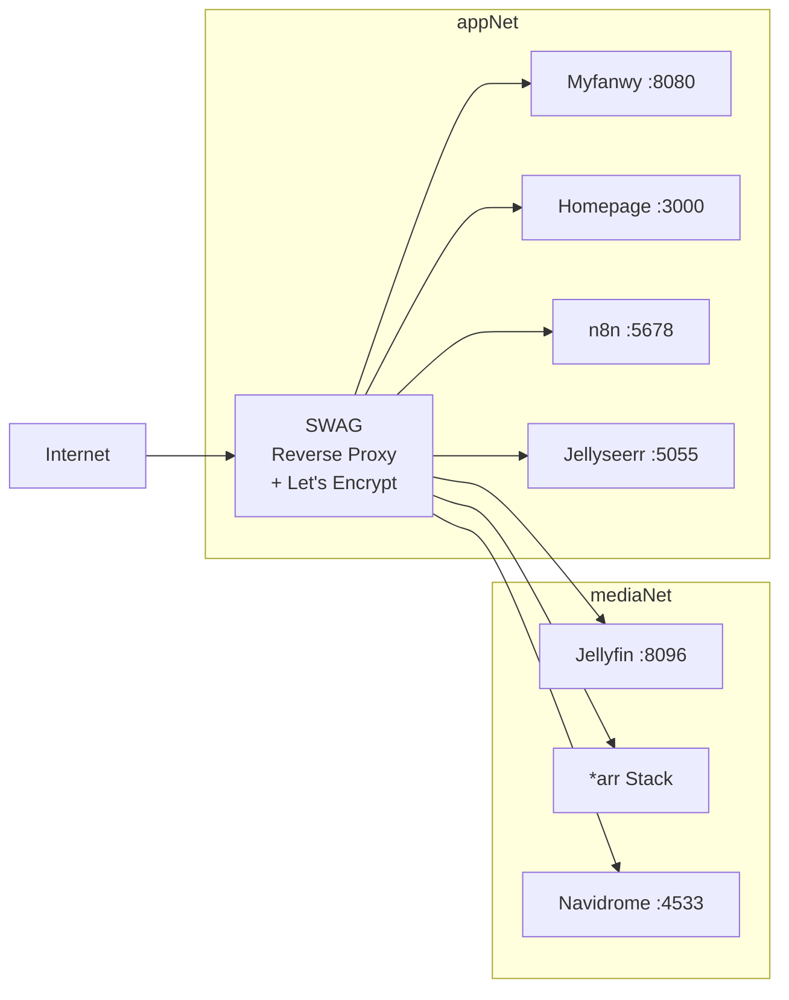

# Architecture Globale

## Vue d'ensemble

Myfanwy est une application Blazor SSR modulaire construite en Clean Architecture avec le pattern CQRS. Elle regroupe plusieurs modules fonctionnels autour d'une infrastructure partagée.

## Stack Technique

| Couche | Technologies |
|--------|-------------|
| **Frontend** | Blazor SSR, Tailwind CSS, Blazor.Bootstrap |
| **Backend** | .NET 10, ASP.NET Core |
| **CQRS** | MediatR |
| **ORM** | Entity Framework Core (SQLite) |
| **Scheduling** | Quartz.NET |
| **IA** | OpenAI API |
| **Stockage** | Azure Blob Storage |
| **Notifications** | Ntfy |
| **Conteneurisation** | Docker |

## Déploiement

En production, Myfanwy tourne derrière SWAG (reverse proxy) avec SSL automatique via Let's Encrypt pour le domaine `checquy.ovh`.

## CI/CD

| Workflow | Déclencheur | Action |
|----------|-------------|--------|
| `dotnet-build.yml` | Push / PR sur `main`, `feature/**` | Build + Tests unitaires |
| `docker-publish.yml` | Release GitHub | Build image Docker multi-stage → Docker Hub |
| `e2e-testing-recap-publication.yml` | Quotidien 16h30 UTC | Tests E2E Bruno → notification Discord si échec |

---

→ Voir [Patterns applicatifs](myfanwy-architecture.md) pour l'architecture interne de l'application.
→ Voir [Guide de démarrage](../development/getting-started.md) pour le setup local.
